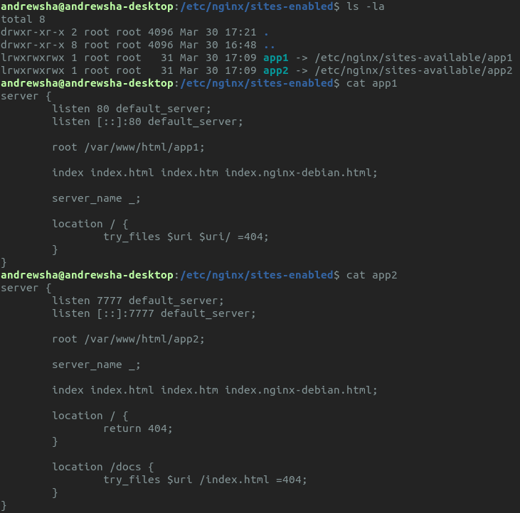
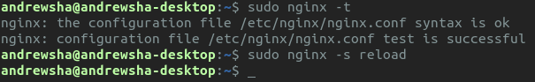
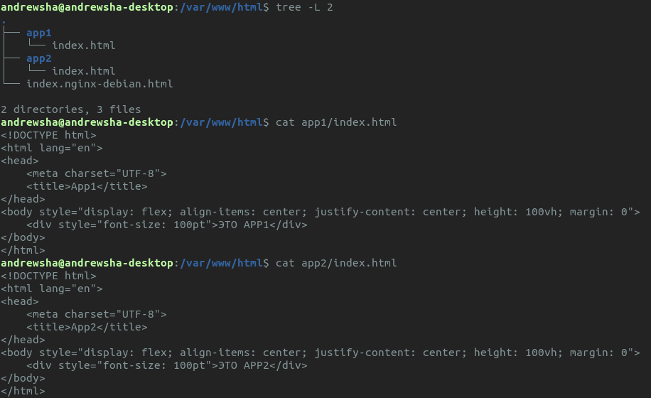

# Задание

Реализовать два приложения, располагающиеся на файловой системе в `/var/www/html/app1/index.html` и `/var/www/html/app2/index.html`, доступные по адресам `http://ip/` и `http://ip:7777/docs/` соответственно с помощью конфигурирования NGINX.

# Выполнение задания

Выполнять я буду на локалхосте, так как в данный момент не имею возможности открывать новые порты на своём сервере.

Выполнив команду `sudo apt install nginx`, я полез в `/etc/nginx/sites-available`, где переименовал `default` на `app1` и убрал оттуда всё лишнее (ну комментарии типа), а также изменил `root` на требуемый. Затем создал `app2` и прописал там аналогичные строчки, что и в `app1`, затем поменял порт с `80` на `7777`, заблокировал корневой локейшн, добавил локейшн `docs` и изменил `root` на требуемый. Потом перешел в `/etc/nginx-sites-enabled`, удалил сломанную ссылку (на недавно переименованный `default`) и создал там символические ссылки на недавно созданные `app1` и `app2`.

В итоге у меня получилось как-то так:

Перезагрузка nginx прошла успешно:

Так как всё отлично, можно преступить к настройке `/var/www/html`. Возьмем несложную html-страничку для каждого нашего приложения, поэтому здесь всё просто.

В итоге получилось так:

# Результаты

Типа первое приложение работает:

Типа второе приложение работает:

Типа во втором приложении `index.html` доступен только с `{host}/docs`:

